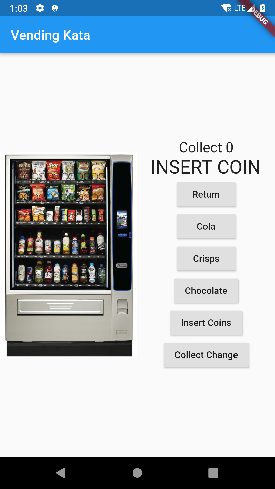

# android-vend-a-kata

A Flutter 'vending machine' app kata.

## Installation

Standard Flutter development requirements:

* Install the Android Studio or VSCode
* Install Flutter & Dart
* Gradle build system
* Android Studio is recommended for ease of testing
* Clone or otherwise acquire the repository

## Usage

* Open the provided Android Studio project
* Use the `debug` variant
* Run the `app` configuration in an emulator or device running Android 7+

## Kata requirements

* accept money, make change, maintain inventory, and dispense products
* one or more views
* network access should not be required
* No special consideration should be made for screen orientation.
* accept coins
  * accept valid coins (5p, 10p, 20p and 50p) and reject invalid ones (pennies)
  * when a valid coin is inserted the amount of the coin will be added to the current amount and the display will be updated
  * when there are no coins inserted, the machine displays "INSERT COIN"
  * rejected coins are placed in the coin return
  * accept user input which is not strictly limited to the valid coins
  * use strings, enums, constants, or something of that nature to represent coins
* select a product
  * three available products: Cola - £1.00, Crisps - £0.50, and Chocolate - £0.65
  * when the respective button is pressed and enough money has been inserted, the product is dispensed and the machine displays "THANK YOU"
  * if the display is checked again, it will display "INSERT COIN" and the current amount will be set to £a0.00
  * if there is not enough money inserted then the machine displays "PRICE" and the price of the item and subsequent checks of the display will display either "INSERT COIN" or the current amount as appropriate
* make change
  * when a product is selected that costs less than the amount of money in the machine, then the remaining amount is placed in the coin return
* return coins
  * when the return coins button is pressed, the money the customer has placed in the machine is returned and the display shows "INSERT COIN"
* sold out
  * when the item selected by the customer is out of stock, the machine displays "SOLD OUT"
  * if the display is checked again, it will display the amount of money remaining in the machine or INSERT COIN if there is no money in the machine.
* exact change only
  * when the machine is not able to make change with the money in the machine for any of the items that it sells, it will display "EXACT CHANGE ONLY" instead of "INSERT COIN"
ill a work-in-progress. All the current tests pass. But, for example, need to implement a small screen landscape layout, service processing and resource loading (as minimal as there is right now) should be taken off the main (UI) thread, etc.

## Developer Notes
This is a port of Jon Adams Android-vend-a-kata
https://github.com/jon-adams/android-vend-a-kata
